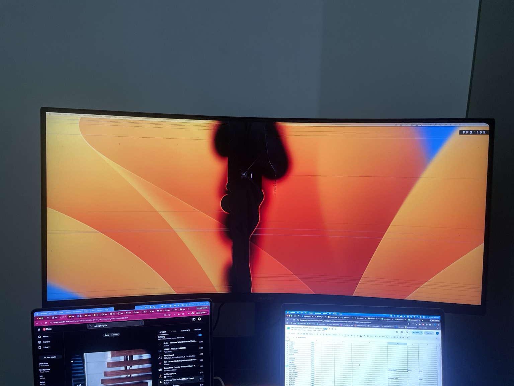
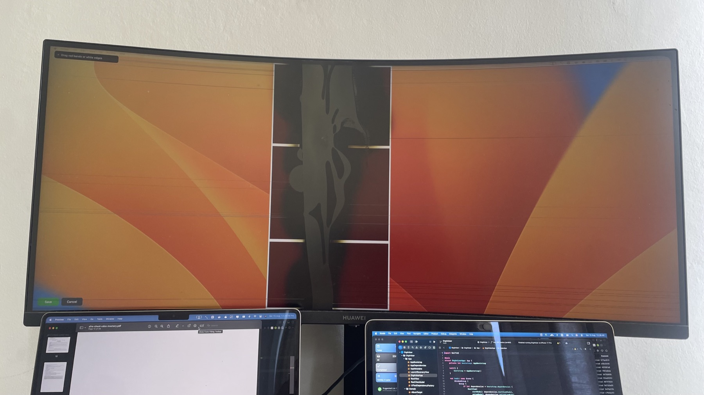
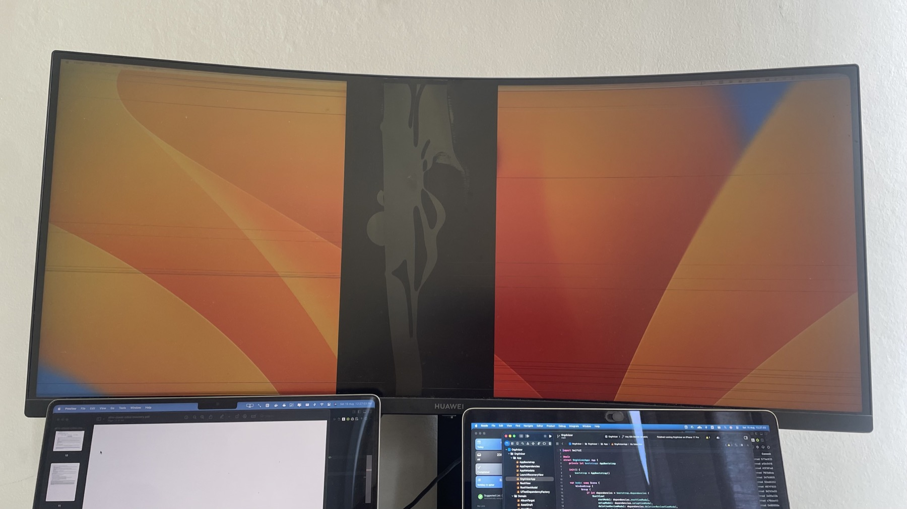

# ScreenFix

ScreenFix masks a damaged vertical display region and keeps ordinary windows in the
usable space on either side. It includes a complete Hammerspoon version and standalone
native apps for Apple Silicon macOS and x64 Windows.

Ready-to-run macOS and Windows downloads are available on the
[Releases page](https://github.com/far1h/ScreenFix/releases).



*The very practical reason ScreenFix exists.*

## Result

Calibrating the three masks:



Saved click-through masks:



Software cannot repair physical screen damage or control dead, leaking, or stuck pixels.
The masks turn responsive pixels black and keep useful content away from the damaged
region; physically black or colored pixels may remain visible.

## Files

```text
.
├── init.lua                         Loads the modules and owns one ScreenFix runtime.
├── assets/results/                  Shows calibration and the saved result.
├── native/macos/                    Builds the Hammerspoon-free Apple Silicon app.
├── native/windows/                  Builds the self-contained Windows x64 app.
├── screenfix/
│   ├── calibration.lua             Provides monitor selection and the three-band editor.
│   ├── controller.lua              Coordinates lifecycle, menu actions, and runtime state.
│   ├── geometry.lua                Calculates mask positions and safe window frames.
│   ├── mask_overlay.lua            Renders click-through black masks across Spaces.
│   ├── screen_config.lua           Validates, saves, and restores monitor calibration.
│   └── window_guard.lua            Detects overlaps and corrects eligible windows.
└── tests/
    ├── run.lua                     Runs the complete Lua test suite.
    ├── test_helper.lua             Supplies the dependency-free test harness.
    ├── fake_hs.lua                 Supplies focused Hammerspoon test doubles.
    └── *_test.lua                  Tests each production module and the entry point.
```

## Install the native Windows app

1. Download `ScreenFix-windows-x64.zip` or `ScreenFix.exe`.
2. Extract the ZIP if needed.
3. Double-click **ScreenFix.exe**.
4. Open the tray icon, choose **Select Monitor**, calibrate the masks, then choose
   **Save**.
5. Windows may show SmartScreen for an unsigned local build. Choose **More info** only
   when the file came from the trusted project release.

Windows x64 means ordinary 64-bit Intel or AMD Windows, not Windows on ARM. The package
is self-contained, so a separate .NET runtime is not required. ScreenFix runs at normal
integrity and cannot move windows launched as administrator; masks and calibration keep
working when an elevated window cannot be corrected.

## Install the native macOS app

1. Extract `ScreenFix-macos-arm64.zip`.
2. Drag **ScreenFix.app** into **Applications**.
3. Control-click **ScreenFix.app**, choose **Open**, and confirm once for the ad-hoc test
   build.
4. Choose the ScreenFix menu-bar icon, then choose **Select Monitor** and the damaged
   display.
5. Move the red bands from their centers or resize them from any white edge. Hold and
   drag with a mouse, or tap, move, and tap again with a trackpad. No modifier key is
   required.
6. Choose **Save** to persist the working copy, or **Cancel** to discard it.
7. When macOS asks, allow ScreenFix in **System Settings > Privacy & Security >
   Accessibility** so it can keep ordinary windows outside the masks.

The native app needs no Hammerspoon process. Its masks and calibration editor work
without Accessibility permission; only automatic window placement pauses until
permission is granted. The menu explains the missing permission, rechecks it
automatically, and starts correction without a Reload after access is granted.

The permanent defaults span exactly 1215–1920 on a 3440-wide display. Protected,
custom, full-screen, or non-movable windows may be left unchanged, and a fixed-size
window is moved only when correction does not require resizing. This local build
supports macOS 13 or later on Apple Silicon, not Intel Macs. Warning-free public
distribution requires an Apple Developer ID and notarization.

## Hammerspoon version requirements

- macOS 13 Ventura or later.
- The [current stable Hammerspoon release](https://www.hammerspoon.org/).
- Accessibility permission for calibration pointer movement and for moving or resizing
  windows: System Settings > Privacy & Security > Accessibility > Hammerspoon.

The black mask and monitor selection work without Accessibility permission. Calibration
movement and window protection remain unavailable until permission is granted. macOS may
require Hammerspoon to be relaunched afterward.

## Install the Hammerspoon version

From the ScreenFix project directory, inspect the destination first:

```bash
ls -ld ~/.hammerspoon ~/.hammerspoon/ScreenFix ~/.hammerspoon/init.lua 2>/dev/null || true
```

If `~/.hammerspoon/ScreenFix` already exists, stop and inspect it. Do not replace it automatically.

When the destination is free, create the configuration directory and link this project:

```bash
mkdir -p ~/.hammerspoon
ln -s "$PWD" ~/.hammerspoon/ScreenFix
```

Add exactly this line once to `~/.hammerspoon/init.lua`. Preserve all existing
configuration; create the file only if it does not exist.

```lua
dofile(hs.configdir .. "/ScreenFix/init.lua")
```

Launch Hammerspoon, or choose **Reload Config** if it is already running. The ScreenFix
display icon appears in the menu bar.

## First run

1. Select the damaged display in the chooser.
2. Move a band from its red center, or resize it from a white edge, until it covers the
   damaged region. Red bands and white resize edges snap within 12 points of the display
   boundary or another band.
3. With a mouse, hold, drag, and release. With a trackpad, tap the target once, move the
   pointer without holding, then tap again. No Shift key is needed.
4. Choose **Save**. ScreenFix remembers the display and calibration, switches to
   click-through masks, and starts window protection when Accessibility is available.

Choose the gray **Cancel** control to exit and discard calibration changes. While the
native macOS editor is open, it covers and intercepts the menu bar, so exit with the
visible Save or Cancel control.

## Menu and startup

Use the ScreenFix menu to:

- **Enable** or **Disable** the saved mask and window protection.
- **Calibrate** the three bands again.
- **Select Monitor** and calibrate a different display.
- **Reset to Defaults** and restore the permanent 1215–1920 horizontal mask span on a
  3440-point display, with the original three vertical sections.
- **Reload** the Hammerspoon configuration.

To start ScreenFix after login, enable Hammerspoon's **Launch at login** preference.
The documented Console equivalent is `hs.autoLaunch(true)`.

## Disable or uninstall

Choose **Disable** to remove the masks and stop window correction without deleting the saved calibration.

To uninstall:

1. Choose **Disable**.
2. Remove only the ScreenFix `dofile` line from `~/.hammerspoon/init.lua`, leaving the rest of the file unchanged.
3. Reload or quit Hammerspoon.
4. Inspect `~/.hammerspoon/ScreenFix` with `ls -ld`. If it is the symbolic link created
   above, remove only the link with `unlink ~/.hammerspoon/ScreenFix`.

Removing the link does not delete the project directory.

## Collaborating

On Windows, run the native tests and publish the asserted single-file x64 app:

```powershell
native\windows\scripts\test-windows-native.ps1
native\windows\scripts\publish-win-x64.ps1
```

On macOS, regenerate and verify the committed Windows icon after editing its SVG:

```bash
native/windows/scripts/build-app-icon.sh
native/windows/scripts/test-build-app-icon.sh
```

Build the native Apple Silicon app and zip from the project root:

```bash
native/macos/scripts/package-arm64.sh
```

Run the complete Hammerspoon test suite with Lua 5.4 or later:

```bash
lua tests/run.lua
```
